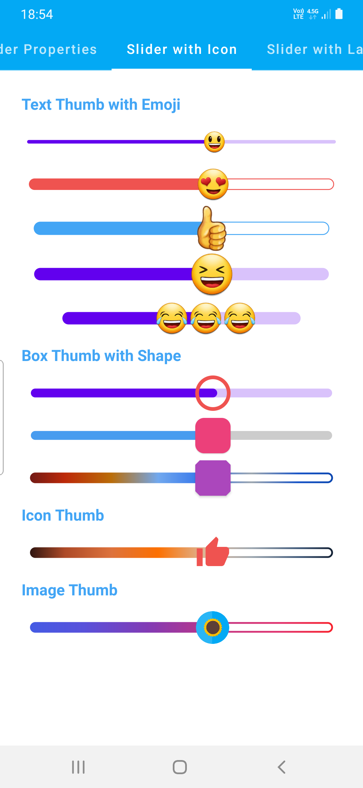
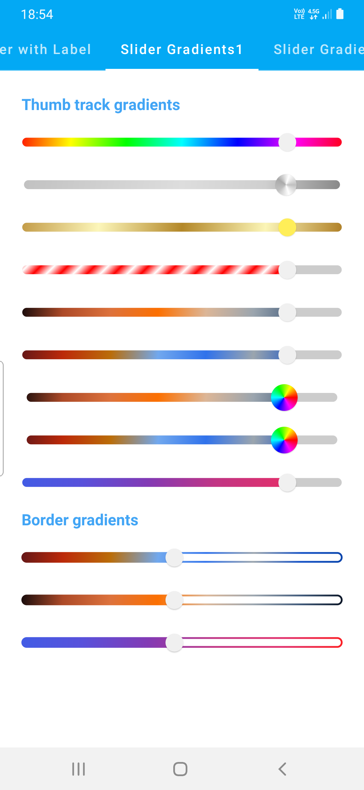
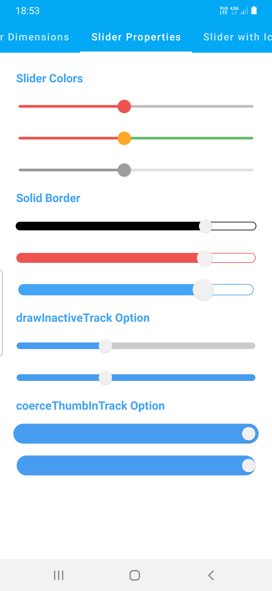
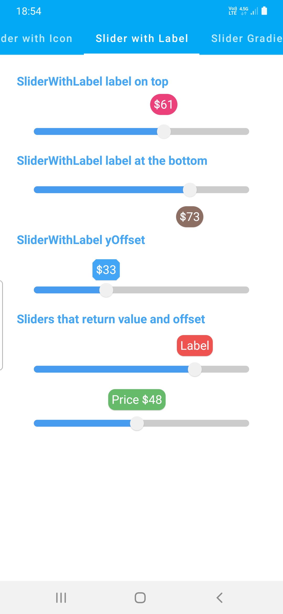
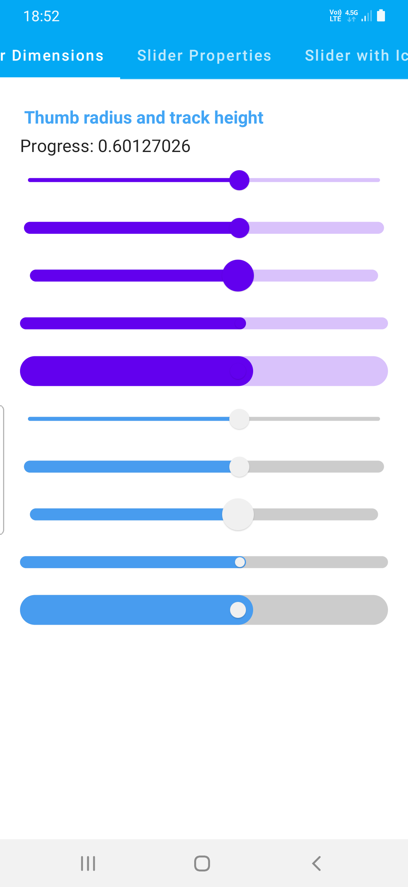

# colorfulsliders-compose-kmp

Elevate default sliders using Jetpack Compose with customizable dimensions, gradients, borders,and dynamic labels. Also, enjoy Kotlin Multiplatform compatibility for ColorfulIconSlider featuring emoji or any Composable thumbs.

## Features

- Create sliders with solid or gradient colors for thumbs and tracks.
- Customize thumb and track sizes, borders, and colors.
- Sliders can use emojis or custom Composables like `Icon` as thumbs.
- Elevate sliders with Jetpack Compose and customize dimensions, gradients, borders, and labels.
- Enjoy Kotlin Multiplatform compatibility for ColorfulIconSlider featuring emoji or any Composable thumbs.

    

# Note

This library offers an enhanced version of [Original Repository](https://github.com/SmartToolFactory/Compose-Colorful-Sliders), now expanded to include Kotlin Multiplatform (KMP) compatibility alongside the improved design system of Jetpack Compose M3, which builds upon the foundations of M2.

**Key Enhancements:**

* **Kotlin Multiplatform Support:** This library now extends beyond Android, bringing the power of Jetpack Compose M3 design to both Android and other platforms, thanks to Kotlin Multiplatform (KMP) capabilities.
* **M3 Design Evolution:** Building upon the success of M2, this library incorporates the refined design principles of Jetpack Compose M3, enhancing user interface aesthetics and functionality.
* **Seamless Transition:** Integrate the library seamlessly into your existing projects that use the [Original Repository](https://github.com/SmartToolFactory/Compose-Colorful-Sliders)

## Usage

### ColorfulSlider

Create sliders with solid or gradient colors for thumbs and tracks, adjustable thumb and track heights, and more.

```kotlin
ColorfulSlider(
    value = progress2,
    thumbRadius = 10.dp,
    trackHeight = 10.dp,
    onValueChange = { it ->
        progress2 = it
    },
    colors = MaterialSliderDefaults.materialColors(
        inactiveTrackColor = SliderBrushColor(color = Color.Transparent),
        activeTrackColor = SliderBrushColor(
            brush = sunriseGradient(),
        )
    ),
    borderStroke = BorderStroke(2.dp, sunriseGradient())
)
```

### SliderWithLabel

Create sliders with labels that display the current progress and allow label customization.

```kotlin
SliderWithLabel(
    value = labelProgress,
    onValueChange = {
        labelProgress = it
    },
    thumbRadius = 10.dp,
    trackHeight = 10.dp,
    valueRange = 0f..100f,
    colors = MaterialSliderDefaults.materialColors(),
    labelPosition = LabelPosition.Bottom,
    label = {
        Text(
            text = "$${labelProgress.roundToInt()}",
            modifier = Modifier
                .shadow(1.dp, shape = CircleShape)
                .background(Brown400, shape = CircleShape)
                .padding(5.dp),
            color = Color.White
        )
    }
)
```


### ColorfulIconSlider

Create sliders with customizable Composables like `Icon` or emojis as thumbs, along with color or gradient options.

```kotlin
ColorfulIconSlider(
    value = progress,
    onValueChange = { value, offset ->
        progress = value
    },
    trackHeight = 14.dp,
    colors = MaterialSliderDefaults.materialColors(
        activeTrackColor = SliderBrushColor(color = Blue400),
        inactiveTrackColor = SliderBrushColor(color = Color.Transparent)
    ),
    borderStroke = BorderStroke(1.dp, Blue400)
) {
    Text(text = "👍", fontSize = 40.sp, color = Color.Black)
}
```
